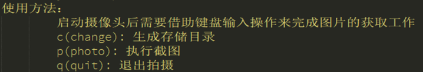
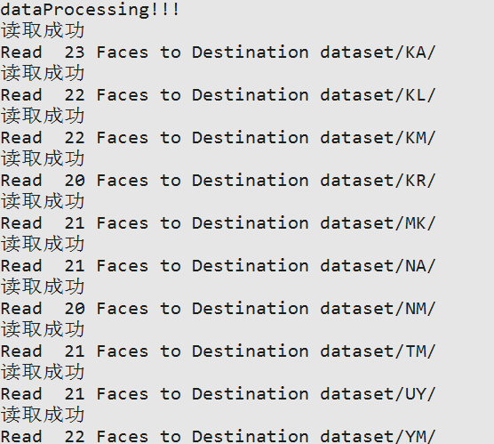
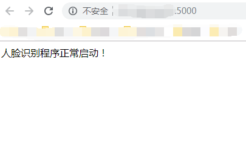
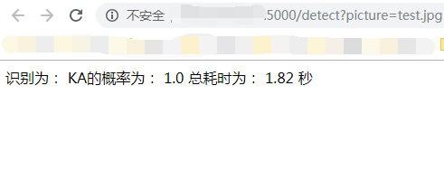

#人脸识别项目

##项目结构介绍
###config：OpenCV的分类器配置文件
###data：网络公开的数据集下载
###dataset：data/中的数据经过标准化处理后存储的目录路径
###pics：存储结果截图

##模块介绍
###getCameraPics.py:基于摄像头视频流数据获取人脸图片并存储
###dataHelper.py:原始图像数据的预处理工作，负责将原始图像转化为标准数据文件
###faceRegnigtionModel.py:人脸识别模块，负责构建模型并保存本地，默认为face.h5
###demoForShow.py:人脸识别展示Demo模块，通过将模型的调用暴露成web服务，实现在浏览器端进行展示
###cameraDemo.py:调用摄像头来进行实时的人脸数据识别

##项目依赖的第三方模块
###OpenCV、TensorFlow、Keras、Numpy、Flask

##项目使用说明
+ 先进入项目所在路径下执行命令： python getCameraPcs.py
如果顺利启动没有报错的话，系统的摄像头就会自动启动开始准备获取自己的照片，操作方法如下图所示：

摄像头启动后，输入法记得调整成英文输入状态，然后点击一下P就会自动照一张相存储到data下面的指定文件夹里面，一般点击100次左右即可（保存下来100张照片，也可以少点自己决定），之后点击Q就可以退出照相关闭摄像头了。
+ 获取到自己的人脸数据之后执行命令  python dataHelper.py  对data文件夹下面的所有图像数据进行格式的归一化。

+ 之后执行命令  python faceRegnigtionModel.py  就开始了模型的训练过程
+ 结束训练后执行命令  python cameraDemo.py  就可以启动人脸识别项目的Demo了，这个模块会启动电脑的摄像头来实时地进行人脸识别。

##项目API服务结果截图
+ 图像归一化结果如下图所示：

+ Web服务接口为：http://IP:5000（其中，IP为自己的IP地址），结果如下图所示：

+ Web服务接口为：http://IP:5000 /detect?picture=test.jpg（其中，IP为自己的IP地址,test为待识别的图片），结果截图如下所示：

